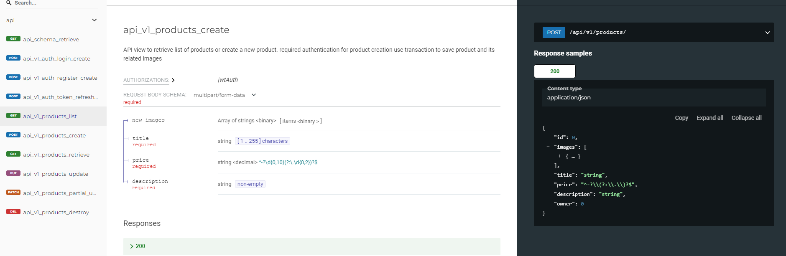

# Shop Management System

## Features

- Django Rest framework
- Dockerized 
- Nginx
- JWT Auth
- API documentation via [drf spectacular](https://drf-spectacular.readthedocs.io/)


## Contents

- [Usage](#usage)
  - [Local](#local)
  - [Production](#production)
- [Api docs](#api-docs)

# Usage

## Local
1- Clone project
```bash
git clone https://github.com/amir77daliri/toman_shop.git
$ cd toman_shop/backend
```
2- Setup env
```bash
$ virtualenv venv
$ source venv/bin/activate
```
3- Create your env

```bash
$ cp .env.sample .env
```
4- Install dependencies
```bash
$ pip install -r requirements.txt
```
5- Create Tables
```bash
$ python manage.py migrate
```
6- Run server
```bash
$ python manage.py runserve
```

## Production

```bash
git clone https://github.com/amir77daliri/toman_shop.git
$ cd toman_shop/backend
$ docker-compose up --build -d
```


## Api docs
Test it out at [Swagger Ui](http://localhost:80/api/schema/swagger-ui/)


Or Test [Swagger Redoc](http://localhost:80/api/schema/redoc/)


